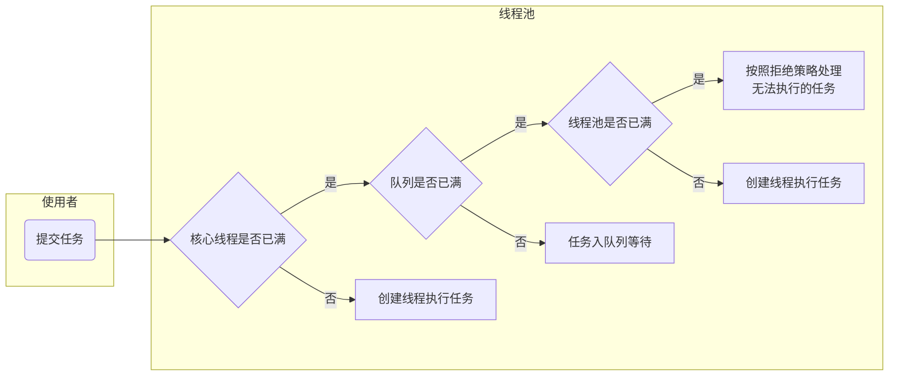

## JUC多线程及高并发

[TOC]

### 一、请你谈谈对volatile的理解

​	`Package java.util.concurrent`---> `AtomicInteger`  `Lock` `ReadWriteLock`

#### 1、volatile是java虚拟机提供的轻量级的同步机制

保证可见性、不保证原子性、禁止指令重排

1. 保证可见性

   当多个线程访问同一个变量时，一个线程修改了这个变量的值，其他线程能够立即看到修改的值

   当不添加volatile关键字时示例：

   ```java
   package com.jian8.juc;
   
   import java.util.concurrent.TimeUnit;
   
   /**
    * 1验证volatile的可见性
    * 1.1 如果int num = 0，number变量没有添加volatile关键字修饰
    * 1.2 添加了volatile，可以解决可见性
    */
   public class VolatileDemo {
   
       public static void main(String[] args) {
           visibilityByVolatile();//验证volatile的可见性
       }
   
       /**
        * volatile可以保证可见性，及时通知其他线程，主物理内存的值已经被修改
        */
       public static void visibilityByVolatile() {
           MyData myData = new MyData();
   
           //第一个线程
           new Thread(() -> {
               System.out.println(Thread.currentThread().getName() + "\t come in");
               try {
                   //线程暂停3s
                   TimeUnit.SECONDS.sleep(3);
                   myData.addToSixty();
                   System.out.println(Thread.currentThread().getName() + "\t update value:" + myData.num);
               } catch (Exception e) {
                   // TODO Auto-generated catch block
                   e.printStackTrace();
               }
           }, "thread1").start();
           //第二个线程是main线程
           while (myData.num == 0) {
               //如果myData的num一直为零，main线程一直在这里循环
           }
           System.out.println(Thread.currentThread().getName() + "\t mission is over, num value is " + myData.num);
       }
   }
   
   class MyData {
       //    int num = 0;
       volatile int num = 0;
   
       public void addToSixty() {
           this.num = 60;
       }
   }
   ```

   输出结果：

   ```java
   thread1	 come in
   thread1	 update value:60
   //线程进入死循环
   ```

   当我们加上`volatile`关键字后，`volatile int num = 0;`输出结果为：

   ```java
   thread1	 come in
   thread1	 update value:60
   main	 mission is over, num value is 60
   //程序没有死循环，结束执行
   ```

   

2. ==不保证原子性==

   原子性：不可分割、完整性，即某个线程正在做某个具体业务时，中间不可以被加塞或者被分割，需要整体完整，要么同时成功，要么同时失败

   验证示例（变量添加volatile关键字，方法不添加synchronized）：

   ```java
   package com.jian8.juc;
   
   import java.util.concurrent.TimeUnit;
   import java.util.concurrent.atomic.AtomicInteger;
   
   /**
    * 1验证volatile的可见性
    *  1.1 如果int num = 0，number变量没有添加volatile关键字修饰
    * 1.2 添加了volatile，可以解决可见性
    *
    * 2.验证volatile不保证原子性
    *  2.1 原子性指的是什么
    *      不可分割、完整性，即某个线程正在做某个具体业务时，中间不可以被加塞或者被分割，需要整体完整，要么同时成功，要么同时失败
    */
   public class VolatileDemo {
   
       public static void main(String[] args) {
   //        visibilityByVolatile();//验证volatile的可见性
           atomicByVolatile();//验证volatile不保证原子性
       }
       
       /**
        * volatile可以保证可见性，及时通知其他线程，主物理内存的值已经被修改
        */
   	//public static void visibilityByVolatile(){}
       
       /**
        * volatile不保证原子性
        * 以及使用Atomic保证原子性
        */
       public static void atomicByVolatile(){
           MyData myData = new MyData();
           for(int i = 1; i <= 20; i++){
               new Thread(() ->{
                   for(int j = 1; j <= 1000; j++){
                       myData.addSelf();
                       myData.atomicAddSelf();
                   }
               },"Thread "+i).start();
           }
           //等待上面的线程都计算完成后，再用main线程取得最终结果值
           try {
               TimeUnit.SECONDS.sleep(4);
           } catch (InterruptedException e) {
               e.printStackTrace();
           }
           while (Thread.activeCount()>2){
               Thread.yield();
           }
           System.out.println(Thread.currentThread().getName()+"\t finally num value is "+myData.num);
           System.out.println(Thread.currentThread().getName()+"\t finally atomicnum value is "+myData.atomicInteger);
       }
   }
   
   class MyData {
       //    int num = 0;
       volatile int num = 0;
   
       public void addToSixty() {
           this.num = 60;
       }
   
       public void addSelf(){
           num++;
       }
       
       AtomicInteger atomicInteger = new AtomicInteger();
       public void atomicAddSelf(){
           atomicInteger.getAndIncrement();
       }
   }
   ```

   执行三次结果为：

   ```java
   //1.
   main	 finally num value is 19580	
   main	 finally atomicnum value is 20000
   //2.
   main	 finally num value is 19999
   main	 finally atomicnum value is 20000
   //3.
   main	 finally num value is 18375
   main	 finally atomicnum value is 20000
   //num并没有达到20000
   ```

   

3. 禁止指令重排

   有序性：在计算机执行程序时，为了提高性能，编译器和处理器常常会对**==指令做重拍==**，一般分以下三种

   ```mermaid
   graph LR
   	源代码 --> id1["编译器优化的重排"]
   	id1 --> id2[指令并行的重排]
   	id2 --> id3[内存系统的重排]
   	id3 --> 最终执行的指令
   	style id1 fill:#ff8000;
   	style id2 fill:#fab400;
   	style id3 fill:#ffd557;
   ```

   单线程环境里面确保程序最终执行结果和代码顺序执行的结果一致。

   处理器在进行重排顺序是必须要考虑指令之间的**==数据依赖性==**

   ==多线程环境中线程交替执行，由于编译器优化重排的存在，两个线程中使用的变量能否保证一致性时无法确定的，结果无法预测==

   重排代码实例：

   声明变量：`int a,b,x,y=0`

   | 线程1          | 线程2          |
   | -------------- | -------------- |
   | x = a;         | y = b;         |
   | b = 1;         | a = 2;         |
   | 结          果 | x = 0      y=0 |

   如果编译器对这段程序代码执行重排优化后，可能出现如下情况：

   | 线程1          | 线程2          |
   | -------------- | -------------- |
   | b = 1;         | a = 2;         |
   | x= a;          | y = b;         |
   | 结          果 | x = 2      y=1 |

   这个结果说明在多线程环境下，由于编译器优化重排的存在，两个线程中使用的变量能否保证一致性是无法确定的

   volatile实现禁止指令重排，从而避免了多线程环境下程序出现乱序执行的现象

   **==内存屏障==**（Memory Barrier）又称内存栅栏，是一个CPU指令，他的作用有两个：

   1. 保证特定操作的执行顺序
   2. 保证某些变量的内存可见性（利用该特性实现volatile的内存可见性）

   由于编译器和处理器都能执行指令重排优化。如果在之零件插入一i奥Memory Barrier则会告诉编译器和CPU，不管什么指令都不能和这条Memory Barrier指令重排顺序，也就是说==通过插入内存屏障禁止在内存屏障前后的指令执行重排序优化==。内存屏障另外一个作用是强制刷出各种CPU的缓存数据，因此任何CPU上的线程都能读取到这些数据的最新版本。

   ```mermaid
   graph TB
       subgraph 
       bbbb["对Volatile变量进行读操作时，<br>回在读操作之前加入一条load屏障指令，<br>从内存中读取共享变量"]
       ids6[Volatile]-->red3[LoadLoad屏障]
       red3-->id7["禁止下边所有普通读操作<br>和上面的volatile读重排序"]
       red3-->red4[LoadStore屏障]
       red4-->id9["禁止下边所有普通写操作<br>和上面的volatile读重排序"]
       red4-->id8[普通读]
       id8-->普通写
       end
       subgraph 
       aaaa["对Volatile变量进行写操作时，<br>回在写操作后加入一条store屏障指令，<br>将工作内存中的共享变量值刷新回到主内存"]
       id1[普通读]-->id2[普通写]
       id2-->red1[StoreStore屏障]
       red1-->id3["禁止上面的普通写和<br>下面的volatile写重排序"]
       red1-->id4["Volatile写"]
       id4-->red2[StoreLoad屏障]
       red2-->id5["防止上面的volatile写和<br>下面可能有的volatile读写重排序"]
       end
       style red1 fill:#ff0000;
       style red2 fill:#ff0000;
       style red4 fill:#ff0000;
       style red3 fill:#ff0000;
       style aaaa fill:#ffff00;
       style bbbb fill:#ffff00;
   ```

   

#### 2、JMM（java内存模型）

JMM（Java Memory Model）本身是一种抽象的概念，并不真实存在，他描述的时一组规则或规范，通过这组规范定义了程序中各个变量（包括实例字段，静态字段和构成数组对象的元素）的访问方式。

**JMM关于同步的规定：**

1. 线程解锁前，必须把共享变量的值刷新回主内存
2. 线程加锁前，必须读取主内存的最新值到自己的工作内存
3. 加锁解锁时同一把锁

由于JVM运行程序的实体是线程，而每个线程创建时JVM都会为其创建一个工作内存（有的成为栈空间），工作内存是每个线程的私有数据区域，而java内存模型中规定所有变量都存储在**==主内存==**，主内存是贡献内存区域，所有线程都可以访问，**==但线程对变量的操作（读取赋值等）必须在工作内存中进行，首先概要将变量从主内存拷贝到自己的工作内存空间，然后对变量进行操作，操作完成后再将变量写回主内存，==**不能直接操作主内存中的变量，各个线程中的工作内存中存储着主内存的**==变量副本拷贝==**，因此不同的线程件无法访问对方的工作内存，线程间的通信（传值）必须通过主内存来完成，期间要访问过程如下图：.jpg)


1. 可见性
2. 原子性
3. 有序性


#### 3、你在那些地方用过volatile

当普通单例模式在多线程情况下：

```java
public class SingletonDemo {
    private static SingletonDemo instance = null;

    private SingletonDemo() {
        System.out.println(Thread.currentThread().getName() + "\t 构造方法SingletonDemo（）");
    }

    public static SingletonDemo getInstance() {
        if (instance == null) {
            instance = new SingletonDemo();
        }
        return instance;
    }

    public static void main(String[] args) {
        //构造方法只会被执行一次
//        System.out.println(getInstance() == getInstance());
//        System.out.println(getInstance() == getInstance());
//        System.out.println(getInstance() == getInstance());

        //并发多线程后，构造方法会在一些情况下执行多次
        for (int i = 0; i < 10; i++) {
            new Thread(() -> {
                SingletonDemo.getInstance();
            }, "Thread " + i).start();
        }
    }
}
```

其构造方法在一些情况下会被执行多次

解决方式：

1. **单例模式DCL代码**

   DCL （Double Check Lock双端检锁机制）在加锁前和加锁后都进行一次判断

   ```java
       public static SingletonDemo getInstance() {
           if (instance == null) {
               synchronized (SingletonDemo.class) {
                   if (instance == null) {
                       instance = new SingletonDemo();
                   }
               }
           }
           return instance;
       }
   ```

   **大部分运行结果构造方法只会被执行一次**，但指令重排机制会让程序很小的几率出现构造方法被执行多次

   **==DCL（双端检锁）机制不一定线程安全==**，原因时有指令重排的存在，加入volatile可以禁止指令重排

   原因是在某一个线程执行到第一次检测，读取到instance不为null时，instance的引用对象可能==没有完成初始化==。instance=new SingleDemo();可以被分为一下三步（伪代码）：

   ```java
   memory = allocate();//1.分配对象内存空间
   instance(memory);	//2.初始化对象
   instance = memory;	//3.设置instance执行刚分配的内存地址，此时instance!=null
   ```

   步骤2和步骤3不存在数据依赖关系，而且无论重排前还是重排后程序的执行结果在单线程中并没有改变，因此这种重排优化时允许的，**如果3步骤提前于步骤2，但是instance还没有初始化完成**

   但是指令重排只会保证串行语义的执行的一致性（单线程），但并不关心多线程间的语义一致性。

   ==所以当一条线程访问instance不为null时，由于instance示例未必已初始化完成，也就造成了线程安全问题。==

2. **单例模式volatile代码**

   为解决以上问题，可以将SingletongDemo实例上加上volatile

   ```java
   private static volatile SingletonDemo instance = null;
   ```


### 二、CAS你知道吗

#### 1、compareAndSet----比较并交换

AtomicInteger.conpareAndSet(int expect, indt update)

```java
    public final boolean compareAndSet(int expect, int update) {
        return unsafe.compareAndSwapInt(this, valueOffset, expect, update);
    }
```

第一个参数为拿到的期望值，如果期望值没有一致，进行update赋值，如果期望值不一致，证明数据被修改过，返回fasle，取消赋值

例子：

```java
package com.jian8.juc.cas;

import java.util.concurrent.atomic.AtomicInteger;

/**
 * 1.CAS是什么？
 * 1.1比较并交换
 */
public class CASDemo {
    public static void main(String[] args) {
       checkCAS();
    }

    public static void checkCAS(){
        AtomicInteger atomicInteger = new AtomicInteger(5);
        System.out.println(atomicInteger.compareAndSet(5, 2019) + "\t current data is " + atomicInteger.get());
        System.out.println(atomicInteger.compareAndSet(5, 2014) + "\t current data is " + atomicInteger.get());
    }
}

```

输出结果为：

```java
true	 current data is 2019
false	 current data is 2019
```

#### 2、CAS底层原理？对Unsafe的理解

比较当前工作内存中的值和主内存中的值，如果相同则执行规定操作，否则继续比较知道主内存和工作内存中的值一直为止

1. atomicInteger.getAndIncrement();

   ```java
       public final int getAndIncrement() {
           return unsafe.getAndAddInt(this, valueOffset, 1);
       }
   ```

2. Unsafe

   - 是CAS核心类，由于Java方法无法直接访问地层系统，需要通过本地（native）方法来访问，Unsafe相当于一个后门，基于该类可以直接操作特定内存数据。Unsafe类存在于`sun.misc`包中，其内部方法操作可以像C的指针一样直接操作内存，因为Java中CAS操作的执行依赖于Unsafe类的方法。

     **Unsafe类中的所有方法都是native修饰的，也就是说Unsafe类中的方法都直接调用操作系统底层资源执行相应任务**

   - 变量valueOffset，表示该变量值在内存中的偏移地址，因为Unsafe就是根据内存便宜地址获取数据的

   - 变量value用volatile修饰，保证多线程之间的可见性

3. CAS是什么

   CAS全称呼Compare-And-Swap，它是一条CPU并发原语

   他的功能是判断内存某个位置的值是否为预期值，如果是则更改为新的值，这个过程是原子的。

   CAS并发原语体现在JAVA语言中就是sun.misc.Unsafe类中各个方法。调用Unsafe类中的CAS方法，JVM会帮我们实现CAS汇编指令。这是一种完全依赖于硬件的功能，通过他实现了原子操作。由于CAS是一种系统原语，原语属于操作系统用语范畴，是由若干条指令组成的，用于完成某个功能的一个过程，并且原语的执行必须是连续的，在执行过程中不允许被中断，也就是说CAS是一条CPU的原子指令，不会造成数据不一致问题。

   ```java
   //unsafe.getAndAddInt
       public final int getAndAddInt(Object var1, long var2, int var4) {
           int var5;
           do {
               var5 = this.getIntVolatile(var1, var2);
           } while(!this.compareAndSwapInt(var1, var2, var5, var5 + var4));
           return var5;
       }
   ```

   var1 AtomicInteger对象本身

   var2 该对象的引用地址

   var4 需要变动的数据

   var5 通过var1 var2找出的主内存中真实的值

   用该对象前的值与var5比较；

   如果相同，更新var5+var4并且返回true，

   如果不同，继续去之然后再比较，直到更新完成

#### 3、CAS缺点

1. ** 循环时间长，开销大**

   例如getAndAddInt方法执行，有个do while循环，如果CAS失败，一直会进行尝试，如果CAS长时间不成功，可能会给CPU带来很大的开销

2. **只能保证一个共享变量的原子操作**

   对多个共享变量操作时，循环CAS就无法保证操作的原子性，这个时候就可以用锁来保证原子性

3. **ABA问题**

### 三、原子类AtomicInteger的ABA问题？原子更新引用？

#### 1、ABA如何产生

CAS算法实现一个重要前提需要去除内存中某个时刻的数据并在当下时刻比较并替换，那么在这个时间差类会导致数据的变化。

比如**线程1**从内存位置V取出A，**线程2**同时也从内存取出A，并且线程2进行一些操作将值改为B，然后线程2又将V位置数据改成A，这时候线程1进行CAS操作发现内存中的值依然时A，然后线程1操作成功。

==尽管线程1的CAS操作成功，但是不代表这个过程没有问题==

#### 2、如何解决？原子引用

示例代码：

```java
package juc.cas;

import lombok.AllArgsConstructor;
import lombok.Getter;
import lombok.ToString;

import java.util.concurrent.atomic.AtomicReference;

public class AtomicRefrenceDemo {
    public static void main(String[] args) {
        User z3 = new User("张三", 22);
        User l4 = new User("李四", 23);
        AtomicReference<User> atomicReference = new AtomicReference<>();
        atomicReference.set(z3);
        System.out.println(atomicReference.compareAndSet(z3, l4) + "\t" + atomicReference.get().toString());
        System.out.println(atomicReference.compareAndSet(z3, l4) + "\t" + atomicReference.get().toString());
    }
}

@Getter
@ToString
@AllArgsConstructor
class User {
    String userName;
    int age;
}
```

输出结果

```java
true	User(userName=李四, age=23)
false	User(userName=李四, age=23)
```

#### 3、时间戳的原子引用

新增机制，修改版本号

```java
package com.jian8.juc.cas;

import java.util.concurrent.TimeUnit;
import java.util.concurrent.atomic.AtomicReference;
import java.util.concurrent.atomic.AtomicStampedReference;

/**
 * ABA问题解决
 * AtomicStampedReference
 */
public class ABADemo {
    static AtomicReference<Integer> atomicReference = new AtomicReference<>(100);
    static AtomicStampedReference<Integer> atomicStampedReference = new AtomicStampedReference<>(100, 1);

    public static void main(String[] args) {
        System.out.println("=====以下时ABA问题的产生=====");
        new Thread(() -> {
            atomicReference.compareAndSet(100, 101);
            atomicReference.compareAndSet(101, 100);
        }, "Thread 1").start();

        new Thread(() -> {
            try {
                //保证线程1完成一次ABA操作
                TimeUnit.SECONDS.sleep(1);
            } catch (InterruptedException e) {
                e.printStackTrace();
            }
            System.out.println(atomicReference.compareAndSet(100, 2019) + "\t" + atomicReference.get());
        }, "Thread 2").start();
        try {
            TimeUnit.SECONDS.sleep(2);
        } catch (InterruptedException e) {
            e.printStackTrace();
        }
        System.out.println("=====以下时ABA问题的解决=====");

        new Thread(() -> {
            int stamp = atomicStampedReference.getStamp();
            System.out.println(Thread.currentThread().getName() + "\t第1次版本号" + stamp);
            try {
                TimeUnit.SECONDS.sleep(2);
            } catch (InterruptedException e) {
                e.printStackTrace();
            }
            atomicStampedReference.compareAndSet(100, 101, atomicStampedReference.getStamp(), atomicStampedReference.getStamp() + 1);
            System.out.println(Thread.currentThread().getName() + "\t第2次版本号" + atomicStampedReference.getStamp());
            atomicStampedReference.compareAndSet(101, 100, atomicStampedReference.getStamp(), atomicStampedReference.getStamp() + 1);
            System.out.println(Thread.currentThread().getName() + "\t第3次版本号" + atomicStampedReference.getStamp());
        }, "Thread 3").start();

        new Thread(() -> {
            int stamp = atomicStampedReference.getStamp();
            System.out.println(Thread.currentThread().getName() + "\t第1次版本号" + stamp);
            try {
                TimeUnit.SECONDS.sleep(4);
            } catch (InterruptedException e) {
                e.printStackTrace();
            }
            boolean result = atomicStampedReference.compareAndSet(100, 2019, stamp, stamp + 1);

            System.out.println(Thread.currentThread().getName() + "\t修改是否成功" + result + "\t当前最新实际版本号：" + atomicStampedReference.getStamp());
            System.out.println(Thread.currentThread().getName() + "\t当前最新实际值：" + atomicStampedReference.getReference());
        }, "Thread 4").start();
    }
}

```

输出结果：

```java
=====以下时ABA问题的产生=====
true	2019
=====以下时ABA问题的解决=====
Thread 3	第1次版本号1
Thread 4	第1次版本号1
Thread 3	第2次版本号2
Thread 3	第3次版本号3
Thread 4	修改是否成功false	当前最新实际版本号：3
Thread 4	当前最新实际值：100
```

### 四、我们知道ArrayList是线程不安全的，请编写一个不安全的案例并给出解决方案

HashSet与ArrayList一致 HashMap

HashSet底层是一个HashMap，存储的值放在HashMap的key里，value存储了一个PRESENT的静态Object对象

#### 1、线程不安全

```java
package com.jian8.juc.collection;

import java.util.ArrayList;
import java.util.List;
import java.util.UUID;

/**
 * 集合类不安全问题
 * ArrayList
 */
public class ContainerNotSafeDemo {
    public static void main(String[] args) {
        notSafe();
    }

    /**
     * 故障现象
     * java.util.ConcurrentModificationException
     */
    public static void notSafe() {
        List<String> list = new ArrayList<>();
        for (int i = 1; i <= 30; i++) {
            new Thread(() -> {
                list.add(UUID.randomUUID().toString().substring(0, 8));
                System.out.println(list);
            }, "Thread " + i).start();
        }
    }
}

```

报错：

```java
Exception in thread "Thread 10" java.util.ConcurrentModificationException
```

#### 2、导致原因

并发正常修改导致

一个人正在写入，另一个同学来抢夺，导致数据不一致，并发修改异常

#### 3、解决方法：**CopyOnWriteArrayList

```
List<String> list = new Vector<>();//Vector线程安全
List<String> list = Collections.synchronizedList(new ArrayList<>());//使用辅助类
List<String> list = new CopyOnWriteArrayList<>();//写时复制，读写分离

Map<String, String> map = new ConcurrentHashMap<>();
Map<String, String> map = Collections.synchronizedMap(new HashMap<>());
```

CopyOnWriteArrayList.add方法：

CopyOnWrite容器即写时复制，往一个元素添加容器的时候，不直接往当前容器Object[]添加，而是先将当前容器Object[]进行copy，复制出一个新的容器Object[] newElements，让后新的容器添加元素，添加完元素之后，再将原容器的引用指向新的容器setArray(newElements),这样做可以对CopyOnWrite容器进行并发的读，而不需要加锁，因为当前容器不会添加任何元素，所以CopyOnWrite容器也是一种读写分离的思想，读和写不同的容器

```java
	public boolean add(E e) {
        final ReentrantLock lock = this.lock;
        lock.lock();
        try {
            Object[] elements = getArray();
            int len = elements.length;
            Object[] newElements = Arrays.copyOf(elements, len + 1);
            newElements[len] = e;
            setArray(newElements);
            return true;
        } finally {
            lock.unlock();
        }
    }
```


### 五、公平锁、非公平锁、可重入锁、递归锁、自旋锁？手写自旋锁

#### 1、公平锁、非公平锁

1. **是什么**

   公平锁就是先来后到、非公平锁就是允许加塞，`Lock lock = new ReentrantLock(Boolean fair);` 默认非公平。

   - **==公平锁==**是指多个线程按照申请锁的顺序来获取锁，类似排队打饭。

   - **==非公平锁==**是指多个线程获取锁的顺序并不是按照申请锁的顺序，有可能后申请的线程优先获取锁，在高并发的情况下，有可能会造成优先级反转或者节现象。

2. **两者区别**

   - **公平锁**：Threads acquire  a fair lock in the order in which they requested it

     公平锁，就是很公平，在并发环境中，每个线程在获取锁时，会先查看此锁维护的等待队列，如果为空，或者当前线程就是等待队列的第一个，就占有锁，否则就会加入到等待队列中，以后会按照FIFO的规则从队列中取到自己。

   - **非公平锁**：a nonfair lock permits barging: threads requesting a lock can jump ahead of the queue of waiting threads if the lock happens to be available when it is requested.

     非公平锁比较粗鲁，上来就直接尝试占有额，如果尝试失败，就再采用类似公平锁那种方式。

3. **other**

   对Java ReentrantLock而言，通过构造函数指定该锁是否公平，磨粉是非公平锁，非公平锁的优点在于吞吐量比公平锁大

   对Synchronized而言，是一种非公平锁

#### 2、可重入所（递归锁）

1. **递归锁是什么**

   指的时同一线程外层函数获得锁之后，内层递归函数仍然能获取该锁的代码，在同一个线程在外层方法获取锁的时候，在进入内层方法会自动获取锁，也就是说，==线程可以进入任何一个它已经拥有的锁所同步着的代码块==

2. **ReentrantLock/Synchronized 就是一个典型的可重入锁**

3. **可重入锁最大的作用是避免死锁**

4. **代码示例**

   ```java
   package com.jian8.juc.lock;
   
   ####
       public static void main(String[] args) {
           Phone phone = new Phone();
           new Thread(() -> {
               try {
                   phone.sendSMS();
               } catch (Exception e) {
                   e.printStackTrace();
               }
           }, "Thread 1").start();
           new Thread(() -> {
               try {
                   phone.sendSMS();
               } catch (Exception e) {
                   e.printStackTrace();
               }
           }, "Thread 2").start();
       }
   }
   class Phone{
       public synchronized void sendSMS()throws Exception{
           System.out.println(Thread.currentThread().getName()+"\t -----invoked sendSMS()");
           Thread.sleep(3000);
           sendEmail();
       }
   
       public synchronized void sendEmail() throws Exception{
           System.out.println(Thread.currentThread().getName()+"\t +++++invoked sendEmail()");
       }
   }
   ```

   ```java
   package com.jian8.juc.lock;
   
   import java.util.concurrent.locks.Lock;
   import java.util.concurrent.locks.ReentrantLock;
   
   public class ReentrantLockDemo {
       public static void main(String[] args) {
           Mobile mobile = new Mobile();
           new Thread(mobile).start();
           new Thread(mobile).start();
       }
   }
   class Mobile implements Runnable{
       Lock lock = new ReentrantLock();
       @Override
       public void run() {
           get();
       }
   
       public void get() {
           lock.lock();
           try {
               System.out.println(Thread.currentThread().getName()+"\t invoked get()");
               set();
           }finally {
               lock.unlock();
           }
       }
       public void set(){
           lock.lock();
           try{
               System.out.println(Thread.currentThread().getName()+"\t invoked set()");
           }finally {
               lock.unlock();
           }
       }
   }
   
   ```

   

#### 3、独占锁(写锁)/共享锁(读锁)/互斥锁

1. **概念**

   - **独占锁**：指该锁一次只能被一个线程所持有，对ReentrantLock和Synchronized而言都是独占锁

   - **共享锁**：只该锁可被多个线程所持有

     **ReentrantReadWriteLock**其读锁是共享锁，写锁是独占锁

   - **互斥锁**：读锁的共享锁可以保证并发读是非常高效的，读写、写读、写写的过程是互斥的

2. **代码示例**

   ```java
   package com.jian8.juc.lock;
   
   import java.util.HashMap;
   import java.util.Map;
   import java.util.concurrent.TimeUnit;
   import java.util.concurrent.locks.Lock;
   import java.util.concurrent.locks.ReentrantReadWriteLock;
   
   /**
    * 多个线程同时读一个资源类没有任何问题，所以为了满足并发量，读取共享资源应该可以同时进行。
    * 但是
    * 如果有一个线程象取写共享资源来，就不应该自由其他线程可以对资源进行读或写
    * 总结
    * 读读能共存
    * 读写不能共存
    * 写写不能共存
    */
   public class ReadWriteLockDemo {
       public static void main(String[] args) {
           MyCache myCache = new MyCache();
           for (int i = 1; i <= 5; i++) {
               final int tempInt = i;
               new Thread(() -> {
                   myCache.put(tempInt + "", tempInt + "");
               }, "Thread " + i).start();
           }
           for (int i = 1; i <= 5; i++) {
               final int tempInt = i;
               new Thread(() -> {
                   myCache.get(tempInt + "");
               }, "Thread " + i).start();
           }
       }
   }
   
   class MyCache {
       private volatile Map<String, Object> map = new HashMap<>();
       private ReentrantReadWriteLock rwLock = new ReentrantReadWriteLock();
   
       /**
        * 写操作：原子+独占
        * 整个过程必须是一个完整的统一体，中间不许被分割，不许被打断
        *
        * @param key
        * @param value
        */
       public void put(String key, Object value) {
           rwLock.writeLock().lock();
           try {
               System.out.println(Thread.currentThread().getName() + "\t正在写入：" + key);
               TimeUnit.MILLISECONDS.sleep(300);
               map.put(key, value);
               System.out.println(Thread.currentThread().getName() + "\t写入完成");
           } catch (Exception e) {
               e.printStackTrace();
           } finally {
               rwLock.writeLock().unlock();
           }
   
       }
   
       public void get(String key) {
           rwLock.readLock().lock();
           try {
               System.out.println(Thread.currentThread().getName() + "\t正在读取：" + key);
               TimeUnit.MILLISECONDS.sleep(300);
               Object result = map.get(key);
               System.out.println(Thread.currentThread().getName() + "\t读取完成: " + result);
           } catch (Exception e) {
               e.printStackTrace();
           } finally {
               rwLock.readLock().unlock();
           }
   
       }
   
       public void clear() {
           map.clear();
       }
   }
   ```

   

#### 4、自旋锁

1. **spinlock**

   是指尝试获取锁的线程不会立即阻塞，而是==采用循环的方式去尝试获取锁==，这样的好处是减少线程上下文切换的消耗，缺点是循环会消耗CPU

   ```java
       public final int getAndAddInt(Object var1, long var2, int var4) {
           int var5;
           do {
               var5 = this.getIntVolatile(var1, var2);
           } while(!this.compareAndSwapInt(var1, var2, var5, var5 + var4));
           return var5;
       }
   ```

   手写自旋锁：

   ```java
   package com.jian8.juc.lock;
   
   import java.util.concurrent.TimeUnit;
   import java.util.concurrent.atomic.AtomicReference;
   
   /**
    * 实现自旋锁
    * 自旋锁好处，循环比较获取知道成功位置，没有类似wait的阻塞
    *
    * 通过CAS操作完成自旋锁，A线程先进来调用mylock方法自己持有锁5秒钟，B随后进来发现当前有线程持有锁，不是null，所以只能通过自旋等待，知道A释放锁后B随后抢到
    */
   public class SpinLockDemo {
       public static void main(String[] args) {
           SpinLockDemo spinLockDemo = new SpinLockDemo();
           new Thread(() -> {
               spinLockDemo.mylock();
               try {
                   TimeUnit.SECONDS.sleep(3);
               }catch (Exception e){
                   e.printStackTrace();
               }
               spinLockDemo.myUnlock();
           }, "Thread 1").start();
   
           try {
               TimeUnit.SECONDS.sleep(3);
           }catch (Exception e){
               e.printStackTrace();
           }
   
           new Thread(() -> {
               spinLockDemo.mylock();
               spinLockDemo.myUnlock();
           }, "Thread 2").start();
       }
   
       //原子引用线程
       AtomicReference<Thread> atomicReference = new AtomicReference<>();
   
       public void mylock() {
           Thread thread = Thread.currentThread();
           System.out.println(Thread.currentThread().getName() + "\t come in");
           while (!atomicReference.compareAndSet(null, thread)) {
   
           }
       }
   
       public void myUnlock() {
           Thread thread = Thread.currentThread();
           atomicReference.compareAndSet(thread, null);
           System.out.println(Thread.currentThread().getName()+"\t invoked myunlock()");
       }
   }
   
   ```

### 六、CountDownLatch/CyclicBarrier/Semaphore使用过吗

#### 1、CountDownLatch（火箭发射倒计时）

1. 它允许一个或多个线程一直等待，知道其他线程的操作执行完后再执行。例如，应用程序的主线程希望在负责启动框架服务的线程已经启动所有的框架服务之后再执行

2. CountDownLatch主要有两个方法，当一个或多个线程调用await()方法时，调用线程会被阻塞。其他线程调用countDown()方法会将计数器减1，当计数器的值变为0时，因调用await()方法被阻塞的线程才会被唤醒，继续执行

3. 代码示例：

   ```java
   package com.jian8.juc.conditionThread;
   
   import java.util.concurrent.CountDownLatch;
   import java.util.concurrent.TimeUnit;
   
   public class CountDownLatchDemo {
       public static void main(String[] args) throws InterruptedException {
   //        general();
           countDownLatchTest();
       }
   
       public static void general(){
           for (int i = 1; i <= 6; i++) {
               new Thread(() -> {
                   System.out.println(Thread.currentThread().getName()+"\t上完自习，离开教室");
               }, "Thread-->"+i).start();
           }
           while (Thread.activeCount()>2){
               try { TimeUnit.SECONDS.sleep(2); } catch (InterruptedException e) { e.printStackTrace(); }
           }
           System.out.println(Thread.currentThread().getName()+"\t=====班长最后关门走人");
       }
   
       public static void countDownLatchTest() throws InterruptedException {
           CountDownLatch countDownLatch = new CountDownLatch(6);
           for (int i = 1; i <= 6; i++) {
               new Thread(() -> {
                   System.out.println(Thread.currentThread().getName()+"\t被灭");
                   countDownLatch.countDown();
               }, CountryEnum.forEach_CountryEnum(i).getRetMessage()).start();
           }
           countDownLatch.await();
           System.out.println(Thread.currentThread().getName()+"\t=====秦统一");
       }
   }
   
   ```

#### 2、CyclicBarrier（集齐七颗龙珠召唤神龙）

1. CycliBarrier

   可循环（Cyclic）使用的屏障。让一组线程到达一个屏障（也可叫同步点）时被阻塞，知道最后一个线程到达屏障时，屏障才会开门，所有被屏障拦截的线程才会继续干活，线程进入屏障通过CycliBarrier的await()方法

2. 代码示例：

   ```java
   package com.jian8.juc.conditionThread;
   
   import java.util.concurrent.BrokenBarrierException;
   import java.util.concurrent.CyclicBarrier;
   
   public class CyclicBarrierDemo {
       public static void main(String[] args) {
           cyclicBarrierTest();
       }
   
       public static void cyclicBarrierTest() {
           CyclicBarrier cyclicBarrier = new CyclicBarrier(7, () -> {
               System.out.println("====召唤神龙=====");
           });
           for (int i = 1; i <= 7; i++) {
               final int tempInt = i;
               new Thread(() -> {
                   System.out.println(Thread.currentThread().getName() + "\t收集到第" + tempInt + "颗龙珠");
                   try {
                       cyclicBarrier.await();
                   } catch (InterruptedException e) {
                       e.printStackTrace();
                   } catch (BrokenBarrierException e) {
                       e.printStackTrace();
                   }
               }, "" + i).start();
           }
       }
   }
   
   ```

#### 3、Semaphore信号量

可以代替Synchronize和Lock

1. **信号量主要用于两个目的，一个是用于多个共享资源的互斥作用，另一个用于并发线程数的控制**

2. 代码示例：

   **抢车位示例**：

   ```
   package com.jian8.juc.conditionThread;
   
   import java.util.concurrent.Semaphore;
   import java.util.concurrent.TimeUnit;
   
   public class SemaphoreDemo {
       public static void main(String[] args) {
           Semaphore semaphore = new Semaphore(3);//模拟三个停车位
           for (int i = 1; i <= 6; i++) {//模拟6部汽车
               new Thread(() -> {
                   try {
                       semaphore.acquire();
                       System.out.println(Thread.currentThread().getName() + "\t抢到车位");
                       try {
                           TimeUnit.SECONDS.sleep(3);//停车3s
                       } catch (InterruptedException e) {
                           e.printStackTrace();
                       }
                       System.out.println(Thread.currentThread().getName() + "\t停车3s后离开车位");
                   } catch (InterruptedException e) {
                       e.printStackTrace();
                   } finally {
                       semaphore.release();
                   }
               }, "Car " + i).start();
           }
       }
   }
   
   ```

### 七、阻塞队列

- **==ArrayBlockingQueue==**是一个基于数组结构的有界阻塞队列，此队列按FIFO原则对元素进行排序
- **==LinkedBlockingQueue==**是一个基于链表结构的阻塞队列，此队列按FIFO排序元素，吞吐量通常要高于ArrayBlockingQueue
- **==SynchronousQueue==**是一个不存储元素的阻塞队列，灭个插入操作必须等到另一个线程调用移除操作，否则插入操作一直处于阻塞状态，吞吐量通常要高于

#### 1、队列和阻塞队列

1. 首先是一个队列，而一个阻塞队列再数据结构中所起的作用大致如下图

   ```mermaid
   graph LR
   Thread1-- put -->id1["阻塞队列"]
   subgraph BlockingQueue
   	id1
   end
   id1-- Take -->Thread2
   蛋糕师父--"放(柜满阻塞)"-->id2[蛋糕展示柜]
   subgraph 柜
   	id2
   end
   id2--"取(柜空阻塞)"-->顾客
   ```

   线程1往阻塞队列中添加元素，而线程2从阻塞队列中移除元素

   当阻塞队列是空是，从队列中==获取==元素的操作会被阻塞

   当阻塞队列是满时，从队列中==添加==元素的操作会被阻塞

   试图从空的阻塞队列中获取元素的线程将会被阻塞，知道其他的线程网空的队列插入新的元素。

   试图网已满的阻塞队列中添加新元素的线程同样会被阻塞，知道其他的线程从列中移除一个或者多个元素或者完全清空队列后使队列重新变得空闲起来并后续新增

#### 2、为什么用？有什么好处？

1. 在多线程领域：所谓阻塞，在某些情况下会挂起线程，一旦满足条件，被挂起的线程又会自动被唤醒

2. 为什么需要BlockingQueue

   好处时我们不需要关心什么时候需要阻塞线程，什么时候需要唤醒线程，因为这一切BlockingQueue都给你一手包办了

   在concurrent包发布以前，在多线程环境下，==我们每个程序员都必须自己控制这些细节，尤其还要兼顾效率和线程安全==，而这回给我们程序带来不小的复杂度

#### 3、BlockingQueue的核心方法

| 方法类型 | 抛出异常  | 特殊值   | 阻塞   | 超时               |
| -------- | --------- | -------- | ------ | ------------------ |
| 插入     | add(e)    | offer(e) | put(e) | offer(e,time,unit) |
| 移除     | remove()  | poll()   | take   | poll(time,unit)    |
| 检查     | element() | peek()   | 不可用 | 不可用             |

| 方法类型 | status                                                       |
| -------- | ------------------------------------------------------------ |
| 抛出异常 | 当阻塞队列满时，再往队列中add会抛`IllegalStateException: Queue full`<br>当阻塞队列空时，在网队列里remove会抛`NoSuchElementException` |
| 特殊值   | 插入方法，成功true失败false<br>移除方法，成功返回出队列的元素，队列里没有就返回null |
| 一直阻塞 | 当阻塞队列满时，生产者线程继续往队列里put元素，队列会一直阻塞线程知道put数据或响应中断退出<br>当阻塞队列空时，消费者线程试图从队列take元素，队列会一直阻塞消费者线程知道队列可用。 |
| 超时退出 | 当阻塞队列满时，队列会阻塞生产者线程一定时间，超过限时后生产者线程会退出 |


#### 4、架构梳理+种类分析

1. 种类分析

   - ==ArrayBlockingQueue==:由数据结构组成的有界阻塞队列。
   - ==LinkedBlockingQueue==:由链表结构组成的有界（但大小默认值为`Integer.MAX_VALUE`)阻塞队列。
   - PriorityBlockingQueue:支持优先级排序的无界阻塞队列。
   - DelayQueue:使用优先级队列实现的延迟无界阻塞队列。
   - ==SychronousQueue==:不存储元素的阻塞队列，也即单个元素的队列。
   - LinkedTransferQueue:由链表结构组成的无界阻塞队列。
   - LinkedBlocking**Deque**:由历览表结构组成的双向阻塞队列。

2. **SychronousQueue**

   - 理论：SynchronousQueue没有容量，与其他BlockingQueue不同，SychronousQueue是一个不存储元素的BlockingQueue，每一个put操作必须要等待一个take操作，否则不能继续添加元素，反之亦然。

   - 代码示例

     ```java
     package com.jian8.juc.queue;
     
     import java.util.concurrent.BlockingQueue;
     import java.util.concurrent.SynchronousQueue;
     import java.util.concurrent.TimeUnit;
     
     /**
      * ArrayBlockingQueue是一个基于数组结构的有界阻塞队列，此队列按FIFO原则对元素进行排序
      * LinkedBlockingQueue是一个基于链表结构的阻塞队列，此队列按FIFO排序元素，吞吐量通常要高于ArrayBlockingQueue
      * SynchronousQueue是一个不存储元素的阻塞队列，灭个插入操作必须等到另一个线程调用移除操作，否则插入操作一直处于阻塞状态，吞吐量通常要高于
      * 1.队列
      * 2.阻塞队列
      * 2.1 阻塞队列有没有好的一面
      * 2.2 不得不阻塞，你如何管理
      */
     public class SynchronousQueueDemo {
         public static void main(String[] args) throws InterruptedException {
             BlockingQueue<String> blockingQueue = new SynchronousQueue<>();
             new Thread(() -> {
                 try {
                     System.out.println(Thread.currentThread().getName() + "\t put 1");
                     blockingQueue.put("1");
                     System.out.println(Thread.currentThread().getName() + "\t put 2");
                     blockingQueue.put("2");
                     System.out.println(Thread.currentThread().getName() + "\t put 3");
                     blockingQueue.put("3");
                 } catch (InterruptedException e) {
                     e.printStackTrace();
                 }
             }, "AAA").start();
             new Thread(() -> {
                 try {
                     TimeUnit.SECONDS.sleep(5);
                     System.out.println(Thread.currentThread().getName() + "\ttake " + blockingQueue.take());
                     TimeUnit.SECONDS.sleep(5);
                     System.out.println(Thread.currentThread().getName() + "\ttake " + blockingQueue.take());
                     TimeUnit.SECONDS.sleep(5);
                     System.out.println(Thread.currentThread().getName() + "\ttake " + blockingQueue.take());
                 } catch (InterruptedException e) {
                     e.printStackTrace();
                 }
             }, "BBB").start();
         }
     }
     
     ```

#### 5、用在哪里

1. 生产者消费者模式

   - 传统版

     ```java
     package com.jian8.juc.queue;
     
     import java.util.concurrent.locks.Condition;
     import java.util.concurrent.locks.Lock;
     import java.util.concurrent.locks.ReentrantLock;
     
     /**
      * 一个初始值为零的变量，两个线程对其交替操作，一个加1一个减1，来5轮
      * 1. 线程  操作  资源类
      * 2. 判断  干活  通知
      * 3. 防止虚假唤起机制
      */
     public class ProdConsumer_TraditionDemo {
         public static void main(String[] args) {
             ShareData shareData = new ShareData();
             for (int i = 1; i <= 5; i++) {
                 new Thread(() -> {
                     try {
                         shareData.increment();
                     } catch (Exception e) {
                         e.printStackTrace();
                     }
                 }, "ProductorA " + i).start();
             }
             for (int i = 1; i <= 5; i++) {
                 new Thread(() -> {
                     try {
                         shareData.decrement();
                     } catch (Exception e) {
                         e.printStackTrace();
                     }
                 }, "ConsumerA  " + i).start();
             }
             for (int i = 1; i <= 5; i++) {
                 new Thread(() -> {
                     try {
                         shareData.increment();
                     } catch (Exception e) {
                         e.printStackTrace();
                     }
                 }, "ProductorB " + i).start();
             }
             for (int i = 1; i <= 5; i++) {
                 new Thread(() -> {
                     try {
                         shareData.decrement();
                     } catch (Exception e) {
                         e.printStackTrace();
                     }
                 }, "ConsumerB  " + i).start();
             }
         }
     }
     
     class ShareData {//资源类
         private int number = 0;
         private Lock lock = new ReentrantLock();
         private Condition condition = lock.newCondition();
     
         public void increment() throws Exception {
             lock.lock();
             try {
                 //1.判断
                 while (number != 0) {
                     //等待不能生产
                     condition.await();
                 }
                 //2.干活
                 number++;
                 System.out.println(Thread.currentThread().getName() + "\t" + number);
                 //3.通知
                 condition.signalAll();
             } catch (Exception e) {
                 e.printStackTrace();
             } finally {
                 lock.unlock();
             }
         }
     
         public void decrement() throws Exception {
             lock.lock();
             try {
                 //1.判断
                 while (number == 0) {
                     //等待不能消费
                     condition.await();
                 }
                 //2.消费
                 number--;
                 System.out.println(Thread.currentThread().getName() + "\t" + number);
                 //3.通知
                 condition.signalAll();
             } catch (Exception e) {
                 e.printStackTrace();
             } finally {
                 lock.unlock();
             }
         }
     }
     
     ```

     

   - 阻塞队列版

     ```java
     package com.jian8.juc.queue;
     
     import java.util.concurrent.ArrayBlockingQueue;
     import java.util.concurrent.BlockingQueue;
     import java.util.concurrent.TimeUnit;
     import java.util.concurrent.atomic.AtomicInteger;
     
     public class ProdConsumer_BlockQueueDemo {
         public static void main(String[] args) {
             MyResource myResource = new MyResource(new ArrayBlockingQueue<>(10));
             new Thread(() -> {
                 System.out.println(Thread.currentThread().getName() + "\t生产线程启动");
                 try {
                     myResource.myProd();
                 } catch (Exception e) {
                     e.printStackTrace();
                 }
             }, "Prod").start();
             new Thread(() -> {
                 System.out.println(Thread.currentThread().getName() + "\t消费线程启动");
                 try {
                     myResource.myConsumer();
                 } catch (Exception e) {
                     e.printStackTrace();
                 }
             }, "Consumer").start();
     
             try { TimeUnit.SECONDS.sleep(5); } catch (InterruptedException e) { e.printStackTrace(); }
             System.out.println("5s后main叫停，线程结束");
             try {
                 myResource.stop();
             } catch (Exception e) {
                 e.printStackTrace();
             }
         }
     }
     
     class MyResource {
         private volatile boolean flag = true;//默认开启，进行生产+消费
         private AtomicInteger atomicInteger = new AtomicInteger();
     
         BlockingQueue<String> blockingQueue = null;
     
         public MyResource(BlockingQueue<String> blockingQueue) {
             this.blockingQueue = blockingQueue;
             System.out.println(blockingQueue.getClass().getName());
         }
     
         public void myProd() throws Exception {
             String data = null;
             boolean retValue;
             while (flag) {
                 data = atomicInteger.incrementAndGet() + "";
                 retValue = blockingQueue.offer(data, 2, TimeUnit.SECONDS);
                 if (retValue) {
                     System.out.println(Thread.currentThread().getName() + "\t插入队列" + data + "成功");
                 } else {
                     System.out.println(Thread.currentThread().getName() + "\t插入队列" + data + "失败");
                 }
                 TimeUnit.SECONDS.sleep(1);
             }
             System.out.println(Thread.currentThread().getName() + "\t大老板叫停了，flag=false，生产结束");
         }
     
         public void myConsumer() throws Exception {
             String result = null;
             while (flag) {
                 result = blockingQueue.poll(2, TimeUnit.SECONDS);
                 if (null == result || result.equalsIgnoreCase("")) {
                     flag = false;
                     System.out.println(Thread.currentThread().getName() + "\t超过2s没有取到蛋糕，消费退出");
                     System.out.println();
                     return;
                 }
                 System.out.println(Thread.currentThread().getName() + "\t消费队列" + result + "成功");
             }
         }
     
         public void stop() throws Exception {
             flag = false;
         }
     }
     ```

     

2. 线程池

3. 消息中间件

#### 6、synchronized和lock有什么区别？用新的lock有什么好处？请举例

> 区别

1. 原始构成

   - synchronized时关键字属于jvm

     **monitorenter**，底层是通过monitor对象来完成，其实wait/notify等方法也依赖于monitor对象只有在同步或方法中才能掉wait/notify等方法

     **monitorexit**

   - Lock是具体类，是api层面的锁（java.util.）

2. 使用方法

   - sychronized不需要用户取手动释放锁，当synchronized代码执行完后系统会自动让线程释放对锁的占用
   - ReentrantLock则需要用户去手动释放锁若没有主动释放锁，就有可能导致出现死锁现象，需要lock()和unlock()方法配合try/finally语句块来完成

3. 等待是否可中断

   - synchronized不可中断，除非抛出异常或者正常运行完成
   - ReentrantLock可中断，设置超时方法tryLock(long timeout, TimeUnit unit)，或者lockInterruptibly()放代码块中，调用interrupt()方法可中断。

4. 加锁是否公平

   - synchronized非公平锁
   - ReentrantLock两者都可以，默认公平锁，构造方法可以传入boolean值，true为公平锁，false为非公平锁

5. 锁绑定多个条件Condition

   - synchronized没有
   - ReentrantLock用来实现分组唤醒需要要唤醒的线程们，可以精确唤醒，而不是像synchronized要么随机唤醒一个线程要么唤醒全部线程。

   ```java
   package com.jian8.juc.lock;
   
   import java.util.concurrent.locks.Condition;
   import java.util.concurrent.locks.Lock;
   import java.util.concurrent.locks.ReentrantLock;
   
   /**
    * synchronized和lock区别
    * <p===lock可绑定多个条件===
    * 对线程之间按顺序调用，实现A>B>C三个线程启动，要求如下：
    * AA打印5次，BB打印10次，CC打印15次
    * 紧接着
    * AA打印5次，BB打印10次，CC打印15次
    * 。。。。
    * 来十轮
    */
   public class SyncAndReentrantLockDemo {
       public static void main(String[] args) {
           ShareData shareData = new ShareData();
           new Thread(() -> {
               for (int i = 1; i <= 10; i++) {
                   shareData.print5();
               }
           }, "A").start();
           new Thread(() -> {
               for (int i = 1; i <= 10; i++) {
                   shareData.print10();
               }
           }, "B").start();
           new Thread(() -> {
               for (int i = 1; i <= 10; i++) {
                   shareData.print15();
               }
           }, "C").start();
       }
   
   }
   
   class ShareData {
       private int number = 1;//A:1 B:2 C:3
       private Lock lock = new ReentrantLock();
       private Condition condition1 = lock.newCondition();
       private Condition condition2 = lock.newCondition();
       private Condition condition3 = lock.newCondition();
   
       public void print5() {
           lock.lock();
           try {
               //判断
               while (number != 1) {
                   condition1.await();
               }
               //干活
               for (int i = 1; i <= 5; i++) {
                   System.out.println(Thread.currentThread().getName() + "\t" + i);
               }
               //通知
               number = 2;
               condition2.signal();
   
           } catch (Exception e) {
               e.printStackTrace();
           } finally {
               lock.unlock();
           }
       }
       public void print10() {
           lock.lock();
           try {
               //判断
               while (number != 2) {
                   condition2.await();
               }
               //干活
               for (int i = 1; i <= 10; i++) {
                   System.out.println(Thread.currentThread().getName() + "\t" + i);
               }
               //通知
               number = 3;
               condition3.signal();
   
           } catch (Exception e) {
               e.printStackTrace();
           } finally {
               lock.unlock();
           }
       }
       public void print15() {
           lock.lock();
           try {
               //判断
               while (number != 3) {
                   condition3.await();
               }
               //干活
               for (int i = 1; i <= 15; i++) {
                   System.out.println(Thread.currentThread().getName() + "\t" + i);
               }
               //通知
               number = 1;
               condition1.signal();
   
           } catch (Exception e) {
               e.printStackTrace();
           } finally {
               lock.unlock();
           }
       }
   }
   ```


### 八、线程池用过吗？ThreadPoolExecutor谈谈你的理解

#### 1、Callable接口的使用

```java
package com.jian8.juc.thread;

import java.util.concurrent.Callable;
import java.util.concurrent.ExecutionException;
import java.util.concurrent.FutureTask;
import java.util.concurrent.TimeUnit;

/**
 * 多线程中，第三种获得多线程的方式
 */
public class CallableDemo {
    public static void main(String[] args) throws ExecutionException, InterruptedException {
        //FutureTask(Callable<V> callable)
        FutureTask<Integer> futureTask = new FutureTask<Integer>(new MyThread2());

        new Thread(futureTask, "AAA").start();
//        new Thread(futureTask, "BBB").start();//复用，直接取值，不要重启两个线程
        int a = 100;
        int b = 0;
        //b = futureTask.get();//要求获得Callable线程的计算结果，如果没有计算完成就要去强求，会导致堵塞，直到计算完成
        while (!futureTask.isDone()) {//当futureTask完成后取值
            b = futureTask.get();
        }
        System.out.println("*******Result" + (a + b));
    }
}

class MyThread implements Runnable {
    @Override
    public void run() {
    }
}

class MyThread2 implements Callable<Integer> {
    @Override
    public Integer call() throws Exception {
        System.out.println("Callable come in");
        try {
            TimeUnit.SECONDS.sleep(5);
        } catch (InterruptedException e) {
            e.printStackTrace();
        }
        return 1024;
    }
}
```

#### 2、为什么使用线程池

1. 线程池做的工作主要是控制运行的线程的数量，处理过程中将任务放入队列，然后在线程创建后启动给这些任务，如果线程数量超过了最大数量，超出数量的线程排队等候，等其他线程执行完毕，再从队列中取出任务来执行

2. 主要特点

   线程复用、控制最大并发数、管理线程

   - 降低资源消耗，通过重复利用已创建的线程降低线程创建和销毁造成的消耗
   - 提过响应速度。当任务到达时，任务可以不需要等到线程创建就能立即执行
   - 提高线程的客观理想。线程是稀缺资源，如果无限制的创建，不仅会消耗系统资源，还会降低系统的稳定性，使用线程池可以进行统一的分配，调优和监控

#### 3、线程池如何使用

1. 架构说明

   Java中的线程池是通过Executor框架实现的，该框架中用到了Executor,Executors,ExecutorService,ThreadPoolExecutor

   ```mermaid
   graph BT
   	类-Executors
   	类-ScheduledThreadPoolExecutor-->类-ThreadPoolExecutor
   	类-ThreadPoolExecutor-->类-AbstractExecutorService
   	类-AbstractExecutorService-.->接口-ExecutorService
   	类-ScheduledThreadPoolExecutor-.->接口-ScheduledExecutorService
   	接口-ScheduledExecutorService-->接口-ExecutorService
   	接口-ExecutorService-->接口-Executor
   ```

2. 编码实现

   实现有五种，Executors.newScheduledThreadPool()是带时间调度的，java8新推出Executors.newWorkStealingPool(int),使用目前机器上可用的处理器作为他的并行级别

   重点有三种

   - Executors.newFixedThreadPool(int) 

     **执行长期的任务，性能好很多**

     创建一个定长线程池，可控制线程最大并发数，炒出的线程回在队列中等待。

     newFixedThreadPool创建的线程池corePoolSize和maximumPoolSize值是想到等的，他使用的是LinkedBlockingQueue

   - Executors.newSingleThreadExecutor()

     **一个任务一个任务执行的场景**

     创建一个单线程话的线程池，他只会用唯一的工作线程来执行任务，保证所有任务按照指定顺序执行

     newSingleThreadExecutor将corePoolSize和maximumPoolSize都设置为1，使用LinkedBlockingQueue

   - Executors.newCachedThreadPool() 

     **执行很多短期异步的小程序或负载较轻的服务器**

     创建一个可缓存线程池，如果线程池长度超过处理需要，可灵活回收空闲县城，若无可回收，则新建线程。

     newCachedThreadPool将corePoolSize设置为0，将maximumPoolSize设置为Integer.MAX_VALUE,使用的SynchronousQueue,也就是说来了任务就创建线程运行，当县城空闲超过60s，就销毁线程

3. **ThreadPoolExecutor**

#### 4、线程池的几个重要参数介绍

```
public ThreadPoolExecutor(int corePoolSize,
                          int maximumPoolSize,
                          long keepAliveTime,
                          TimeUnit unit,
                          BlockingQueue<Runnable> workQueue,
                          ThreadFactory threadFactory,
                          RejectedExecutionHandler handler)
```

1. **==corePoolSize==**：线程池中常驻核心线程数
   - 在创建了线程池后，当有请求任务来之后，就会安排池中的线程去执行请求任务
   - 当线程池的线程数达到corePoolSize后，就会把到达的任务放到缓存队列当中
2. **==maximumPoolSize==**：线程池能够容纳同时执行的最大线程数，必须大于等于1
3. **==keepAliveTime==**：多余的空闲线程的存活时间
   - 当前线程池数量超过corePoolSize时，档口空闲时间达到keepAliveTime值时，多余空闲线程会被销毁到只剩下corePoolSize个线程为止
4. **==unit==**：keepAliveTime的单位
5. **==workQueue==**：任务队列，被提交但尚未被执行的任务
6. **==threadFactory==**：表示生成线程池中工作线程的线程工厂，用于创建线程一般用默认的即可
7. **==handler==**：拒绝策略，表示当队列满了并且工作线程大于等于线程池的最大线程数（maximumPoolSize）时如何来拒绝请求执行的runable的策略

#### 5、线程池的底层工作原理



**==流程==**

1. 在创建了线程池之后，等待提交过来的 人物请求。

2. 当调用execute()方法添加一个请求任务时，线程池会做出如下判断

   2.1 如果正在运行的线程数量小于corePoolSize，那么马上船舰线程运行这个任务；

   2.2 如果正在运行的线程数量大于或等于corePoolSize，那么将这个任务放入队列；

   2.3如果此时队列满了且运行的线程数小于maximumPoolSize，那么还是要创建非核心线程立刻运行此任务

   2.4如果队列满了且正在运行的线程数量大于或等于maxmumPoolSize，那么启动饱和拒绝策略来执行

3. 当一个线程完成任务时，他会从队列中却下一个任务来执行

4. 当一个线程无事可做超过一定的时间（keepAliveTime）时，线程池会判断：

   如果当前运行的线程数大于corePoolSize，那么这个线程会被停掉；所以线程池的所有任务完成后他最大会收缩到corePoolSize的大小

   

### 九、线程池用过吗？生产上你如何设置合理参数

#### 1、线程池的拒绝策略

1. 什么是线程策略

   等待队列也已经排满了，再也塞不下新任务了，同时线程池中的max线程也达到了，无法继续为新任务服务。这时我们就需要拒绝策略机制合理的处理这个问题。

2. JDK内置的拒绝策略

   - AbortPolicy(默认)

     直接抛出RejectedExecutionException异常阻止系统正常运行

   - CallerRunsPolicy

     ”调用者运行“一种调节机制，该策略既不会抛弃任务，也不会抛出异常，而是将某些任务回退到调用者，从而降低新任务的流量

   - DiscardOldestPolicy

     抛弃队列中等待最久的任务，然后把当前任务加入队列中尝试再次提交当前任务

   - DiscardPolicy

     直接丢弃任务，不予任何处理也不抛异常。如果允许任务丢失，这是最好的一种方案

3. 均实现了RejectedExecutionHandler接口

#### 2、你在工作中单一的/固定数的/可变的三种创建线程池的方法，用哪个多

**==一个都不用，我们生产上只能使用自定义的！！！！==**

为什么？

线程池不允许使用Executors创建，试试通过ThreadPoolExecutor的方式，规避资源耗尽风险

FixedThreadPool和SingleThreadPool允许请求队列长度为Integer.MAX_VALUE，可能会堆积大量请求；；CachedThreadPool和ScheduledThreadPool允许的创建线程数量为Integer.MAX_VALUE，可能会创建大量线程，导致OOM

#### 3、你在工作中时如何使用线程池的，是否自定义过线程池使用

```java
package com.jian8.juc.thread;

import java.util.concurrent.*;

/**
 * 第四种获得java多线程的方式--线程池
 */
public class MyThreadPoolDemo {
    public static void main(String[] args) {
        ExecutorService threadPool = new ThreadPoolExecutor(3, 5, 1L,
                							TimeUnit.SECONDS,
                							new LinkedBlockingDeque<>(3),
                                            Executors.defaultThreadFactory(), 
                                            new ThreadPoolExecutor.DiscardPolicy());
//new ThreadPoolExecutor.AbortPolicy();
//new ThreadPoolExecutor.CallerRunsPolicy();
//new ThreadPoolExecutor.DiscardOldestPolicy();
//new ThreadPoolExecutor.DiscardPolicy();
        try {
            for (int i = 1; i <= 10; i++) {
                threadPool.execute(() -> {
                    System.out.println(Thread.currentThread().getName() + "\t办理业务");
                });
            }
        } catch (Exception e) {
            e.printStackTrace();
        } finally {
            threadPool.shutdown();
        }
    }
}

```


#### 4、合理配置线程池你是如何考虑的？

1. **CPU密集型**

   CPU密集的意思是该任务需要大量的运算，而没有阻塞，CPU一直全速运行

   CPU密集任务只有在真正多核CPU上才可能得到加速（通过多线程）

   而在单核CPU上，无论你开几个模拟的多线程该任务都不可能得到加速，因为CPU总的运算能力就那些

   CPU密集型任务配置尽可能少的线程数量：

   ==**一般公式：CPU核数+1个线程的线程池**==

2. **IO密集型**

   - 由于IO密集型任务线程并不是一直在执行任务，则应配置经可能多的线程，如CPU核数 * 2

   - IO密集型，即该任务需要大量的IO，即大量的阻塞。

     在单线程上运行IO密集型的任务会导致浪费大量的 CPU运算能力浪费在等待。

     所以在IO密集型任务中使用多线程可以大大的加速程序运行，即使在单核CPU上，这种加速主要就是利用了被浪费掉的阻塞时间。

     IO密集型时，大部分线程都阻塞，故需要多配置线程数：

     参考公式：==CPU核数/（1-阻塞系数） 阻塞系数在0.8~0.9之间==

     八核CPU：8/（1-0，9）=80


### 十、死锁编码及定位分析

1. 是什么

   死锁是指两个或两个以上的进程在执行过程中，因争夺资源而造成的一种互相等待的现象，若无外力干涉那他们都将无法推进下去，如果系统资源充足，进程的资源请求都能够得到满足，死锁出现的可能性就很低，否则就会因争夺有限的资源而陷入死锁。

   ```mermaid
   graph TD
    threadA(线程A)
    threadB(线程B)
    lockA((锁A))
    lockB((锁B))
    threadA--持有-->lockA
    threadB--试图获取-->lockA
    threadB--持有-->lockB
    threadA--试图获取-->lockB
   ```

2. 产生死锁的主要原因

   - 系统资源不足
   - 进程运行推进的顺序不合适
   - 资源分配不当

3. 死锁示例

   ```java
   package com.jian8.juc.thread;
   
   import java.util.concurrent.TimeUnit;
   
   /**
    * 死锁是指两个或两个以上的进程在执行过程中，因争夺资源而造成的一种互相等待的现象，若无外力干涉那他们都将无法推进下去，
    */
   public class DeadLockDemo {
       public static void main(String[] args) {
           String lockA = "lockA";
           String lockB = "lockB";
           new Thread(new HoldThread(lockA,lockB),"Thread-AAA").start();
           new Thread(new HoldThread(lockB,lockA),"Thread-BBB").start();
       }
   }
   
   class HoldThread implements Runnable {
   
       private String lockA;
       private String lockB;
   
       public HoldThread(String lockA, String lockB) {
           this.lockA = lockA;
           this.lockB = lockB;
       }
   
       @Override
       public void run() {
           synchronized (lockA) {
               System.out.println(Thread.currentThread().getName() + "\t自己持有：" + lockA + "\t尝试获得：" + lockB);
               try {
                   TimeUnit.SECONDS.sleep(2);
               } catch (InterruptedException e) {
                   e.printStackTrace();
               }
               synchronized (lockB) {
                   System.out.println(Thread.currentThread().getName() + "\t自己持有：" + lockB + "\t尝试获得：" + lockA);
               }
           }
       }
   }
   
   ```

4. 解决

   1. 使用`jps -l`定位进程号
   2. `jstack 进程号`找到死锁查看